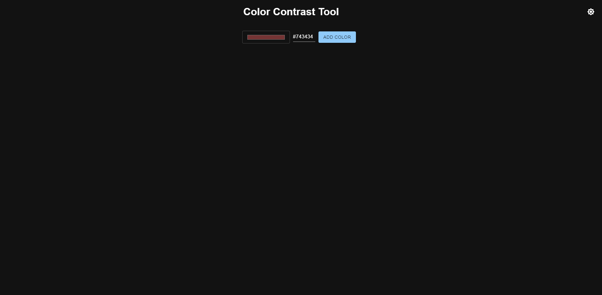
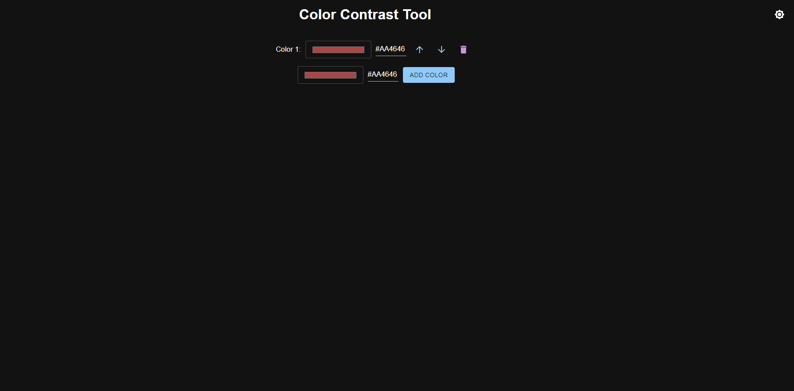
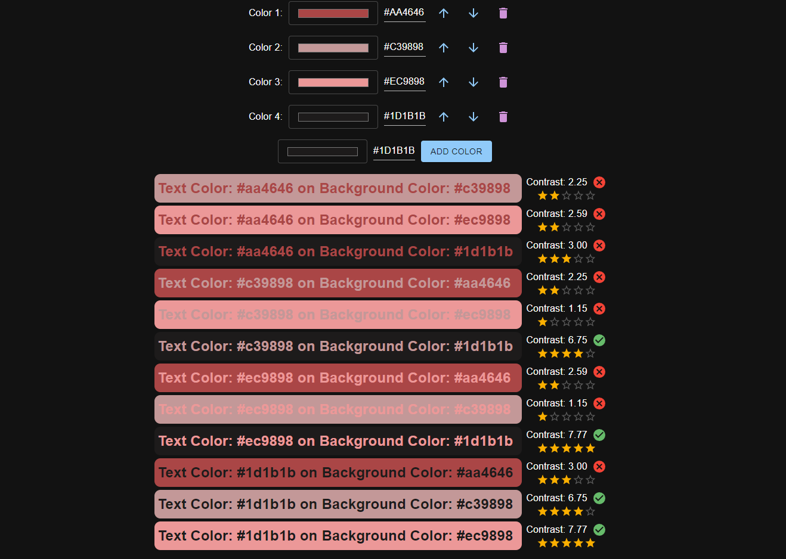
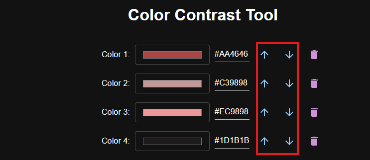
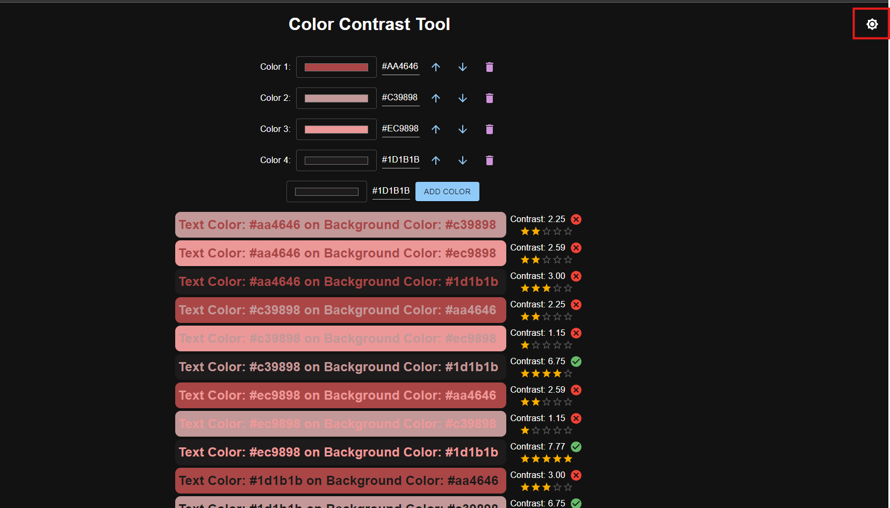

# Color contrast tool

Color pallette contrast checker built using react.js, tinycolor for calculating contrast ratio, and Material UI for UI components

For graphic designers and UI designers

## How to use

Go to the website: [colorcontrasttool.netlify.app](https://colorcontrasttool.netlify.app/)

1. To add a color to your palette click on the color input to select a color

<<<<<<< HEAD

2. Then press ADD COLOR to add selected color to the palette

3. Keep repeating steps 1-2 until you have your desired palette

=======

2. Then press ADD COLOR to add selected color to the palette

3. Keep repeating steps 1-2 until you have your desired palette

>>>>>>> ed9b6737cae7a832cad43aa0a4d64556d86a8acf

4. Each color chosen will list every color combination (text color + background color) and display the contrast ratio and rate them according to WCAG 2.0.

The stars indicate the WCAG standard:

Here is how the number of stars are calculated:
if contrast ratio >= 7, output 5 stars // AAA for normal text
<<<<<<< HEAD

if contrast ratio >= 4.5, output 4 stars // AA for normal text or AAA for large text

if contrast ratio >= 3, output 3 stars // AA for large text or for UI components

if contrast ratio >= 2, output 2 stars // Below standard, but somewhat discernible

=======
if contrast ratio >= 4.5, output 4 stars // AA for normal text or AAA for large text
if contrast ratio >= 3, output 3 stars // AA for large text or for UI components
if contrast ratio >= 2, output 2 stars // Below standard, but somewhat discernible
>>>>>>> ed9b6737cae7a832cad43aa0a4d64556d86a8acf
else, output 1 star // Poor contrast

It will also display a check mark or x next to the contrast ratio indicating that it has met the minimum recommendation for readability according to WCAG: 4.5 contrast score

5. If you want to move your chosen color up or down the pallette use the arrows next to the chosen colors

<<<<<<< HEAD

6. If the current theme (dark mode) interferes with your palette try using the toggle dark/light mode button at the top right of the screen:

=======

6. If the current theme (dark mode) interferes with your palette try using the toggle dark/light mode button at the top right of the screen:

>>>>>>> ed9b6737cae7a832cad43aa0a4d64556d86a8acf
