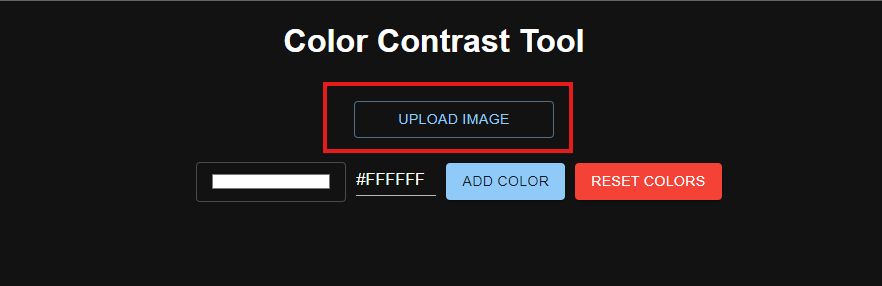
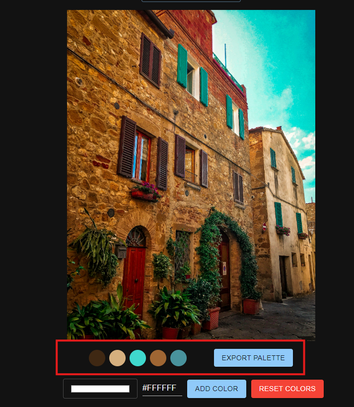
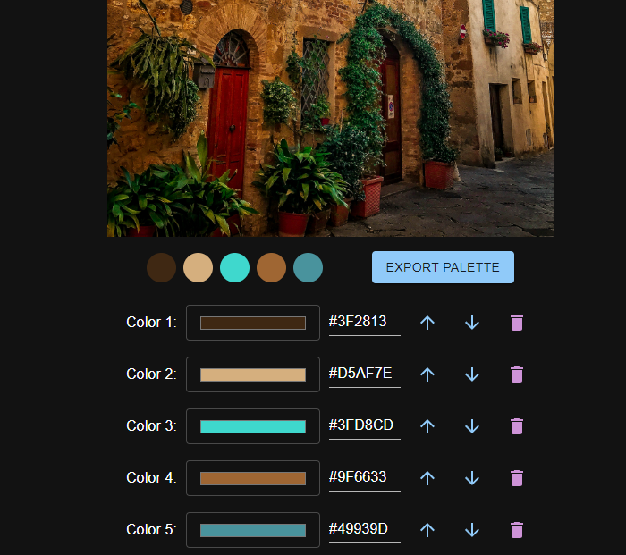

# Color contrast tool

Color pallette contrast checker built using react.js, tinycolor for calculating contrast ratio, and Material UI for UI components

For graphic designers and UI designers

## How to use

Go to the website: [colorcontrasttool.netlify.app](https://colorcontrasttool.netlify.app/)

1. To add a color to your palette click on the color input to select a color

2. Then press ADD COLOR to add selected color to the palette

3. Keep repeating steps 1-2 until you have your desired palette

4. Each color chosen will list every color combination (text color + background color) and display the contrast ratio and rate them according to WCAG 2.0.

The stars indicate the WCAG standard:

Here is how the number of stars are calculated:
if contrast ratio >= 7, output 5 stars // AAA for normal text

if contrast ratio >= 4.5, output 4 stars // AA for normal text or AAA for large text

if contrast ratio >= 3, output 3 stars // AA for large text or for UI components

if contrast ratio >= 2, output 2 stars // Below standard, but somewhat discernible

It will also display a check mark or x next to the contrast ratio indicating that it has met the minimum recommendation for readability according to WCAG: 4.5 contrast score

5. If you want to move your chosen color up or down the pallette use the arrows next to the chosen colors

6. If the current theme (dark mode) interferes with your palette try using the toggle dark/light mode button at the top right of the screen:

## latest feature: Upload Image palette extractor

Upload an image to extract its color palette

After selecting a file and uploading it, it should display its image along with the generated color palette below it

From here you can either choose individual colors generated by the image by clicking the colors or extracting all the colors using the EXPORT PALETTE button.

